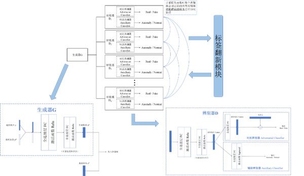
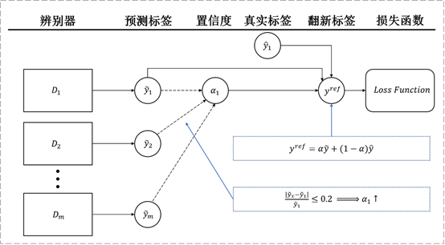

# LR-EGAN 模型描述

LR-EGAN模型在EAL-GAN 模型的基础上改进了训练策略，增加了一个标签翻新模块。模型结构如上图所示，由一个生成器、多个集成的判别器和一个标签翻新模块构成，通过生成器生成伪样本有助于克服异常检测任务中常见的类别不平衡问题；通过标签翻新模块对训练样本标签进行动态调整生成伪标签，有利于克服数据中的噪声标签问题。

这里主要介绍我们提出的标签翻新模块相关算法设计，原始EAL-GAN相关算法在模型结构中有部分简单介绍，详细请参考原论文: Chen Z, Duan J, Kang L, et al. Supervised anomaly detection via conditional generative adversarial network and ensemble active learning[J]. arXiv preprint arXiv:2104.11952, 2021. 论文链接：[https://arxiv.org/abs/2104.11952v1](https://arxiv.org/abs/2104.11952v1)。标签翻新模块是为了解决异常检测领域真实数据中常出现的标签错误的情况：因为异常具有数量少，多样性、异构性强的特点，有些异常样本非常隐蔽，难以辨别，在真实数据中常常被打上正常的标签。

标签翻新模块如上图所示，我们在辨别器输出分数，损失函数计算损失以进行反向传播之前，添加标签翻新模块。对于每个样本，将所有辨别器中得到的预测标签和该辨别器中得到的预测标签进行比较，如差值百分比在一个阈值（比如20%）以内，则说明与该辨别器得到的结果相近。越多辨别器支持该辨别器的结果，则该辨别器的置信度α的值越大。通过将含有噪声的真实标签和当前模型预测标签的凸组合来获得翻新标签，使用此翻新标签替代真实标签进行反向传播，以此降低对真实标签的依赖。

 

# 数据集

|Dataset (数据集名称)|Number of Instances (实例个数)|Feature Dimension (特征维度)|Anomaly Ratio (异常比例)|
| ----------------------| --------------------------------| ------------------------------| --------------------------|
|Lympho|148|18|4.05%|
|Glass|214|9|4.21%|
|Ionosphere|351|33|35.90%|
|Arrhythmia|452|274|14.60%|
|Pima|768|8|34.90%|
|Vowels|1456|12|3.43%|
|Letter|1600|32|6.25%|
|Cardio|1831|21|9.61%|
|Musk|3062|166|3.17%|
|Optdigits|5216|64|2.88%|
|Satimage2|5803|36|1.22%|
|Satellite|6435|36|31.64%|
|Pendigits|6870|16|2.27%|
|Annthyroid|7200|21|7.42%|
|Mnist|7603|100|9.21%|
|Shuttle|49097|9|7.15%|

本项目选取了异常检测任务中16个常见的数据集进行了实验，这些数据集涵盖了多种不同的应用场景并且在大小、特征维度、异常比例等特性上多样性都较高，能够较为全面地对模型的性能进行评估。训练时按照 6：2：2的 比例随机划分了训练集、验证集和测试集。

# 环境要求

* 硬件

  使用Ascend、GPU或者CPU来搭建硬件环境
* 框架

  [MindSpore](https://www.mindspore.cn/install/en)
* 如需查看详情，请参见如下资源：

  [MindSpore教程](https://www.mindspore.cn/tutorials/zh-CN/r1.3/index.html)

  [MindSpore Python API](https://www.mindspore.cn/docs/api/zh-CN/r1.3/index.html)

# 项目结构说明

## 数据文件

下载处理好的 mat 文件即可，下载连接见下；将下载好的数据放在RL-EGAN/data 下

> Lympho：<http://odds.cs.stonybrook.edu/lympho/>
>
> Glass:  <http://odds.cs.stonybrook.edu/glass-data/>
>
> Ionosphere:  <http://odds.cs.stonybrook.edu/ionosphere-dataset/>
>
> Arrhythmia:  <http://odds.cs.stonybrook.edu/arrhythmia-dataset/>
>
> Pima:  <http://odds.cs.stonybrook.edu/pima-indians-diabetes-dataset/>
>
> Vowels:  <http://odds.cs.stonybrook.edu/japanese-vowels-data/>
>
> Letter:  <http://odds.cs.stonybrook.edu/letter-recognition-dataset/>
>
> Cardio:  <http://odds.cs.stonybrook.edu/cardiotocogrpahy-dataset/>
>
> Musk:  <http://odds.cs.stonybrook.edu/musk-dataset/>
>
> Optdigits:  <http://odds.cs.stonybrook.edu/optdigits-dataset/>
>
> Satimage-2:  <http://odds.cs.stonybrook.edu/satimage-2-dataset/>
>
> Satellite:  <http://odds.cs.stonybrook.edu/satellite-dataset/>
>
> Pendigits:  <http://odds.cs.stonybrook.edu/pendigits-dataset/>
>
> Annthyroid:  <http://odds.cs.stonybrook.edu/annthyroid-dataset/>
>
> Mnist:  <http://odds.cs.stonybrook.edu/mnist-dataset/>
>
> Shuttle:  <http://odds.cs.stonybrook.edu/shuttle-dataset/>
>

下载好后的文件结构如下

> data
> │ annthyroid.mat  
> │ arrhythmia.mat  
> │ cardio.mat  
> │ glass.mat  
> │ ionosphere.mat  
> │ letter.mat  
> │ lympho.mat  
> │ mnist.mat  
> │ musk.mat  
> │ optdigits.mat  
> │ pendigits.mat  
> │ pima.mat  
> │ satellite.mat  
> │ satimage-2.mat  
> │ shuttle.mat  
> │ vowels.mat

## 脚本及样例代码

脚本及样例代码结构如下:

> LR-EGAN
>
> │  configs.py                                            #脚本参数 │  dataloader.py                                      #数据集加载  
> │  preprocess.py                                      #数据预处理  
> │  README.md  
> │  TrainAndEval.py                                   #训练和评估代码  
> │  
> ├─assets                                                  #README使用的资源文件  
> │ │  
> ├─results                                                  #结果记录  
> │      AUC_CB_GAN_data.csv  
> │      Gmean_CB_GAN_data.csv  
> │  
> ├─scripts │      LR-EGAN_eval_1p.sh                       #验证脚本  
> │      LR-EGAN_train_1p.sh                      #训练脚本 │  
> └─src                                                       #模型文件  
> LR-EGAN.py  
> losses.py  
> pyod_utils.py  
> utils.py
>

## 脚本参数

在LR-EGAN/config.py中可以同时配置训练参数和评估参数

配置LR-EGAN和数据集

> mode="train"                                    # 训练还是评估模型, "train"为重头训练,"eval" 会加载训练好的模型
>
> data_name="shuttle"                        #数据集名称
>
> max_epochs=100                              #训练代数
>
> print_epochs=1                                 #打印模型推理结果间隔的代数
>
> lr_g=0.001                                         #生成器的学习率
>
> lr_d=0.001                                         #辨别其的学习率
>
> active_rate=1                                    #主动学习策略中挑选学习样本比例 
>
> batch_size=2048                               #一个batch 中样本的个数
>
> dim_z=128                                        #生成器随机噪声的维度
>
> dis_layer=1        #辨别器层的深度
>
> gen_layer=2                                      #生成器层的深度
>
> ensemble_num=10                           #集成辨别器个数
>
> device="Ascend"                              #调整使用的设备
>
> init_type="N02"                                #网络参数初始化方式
>
> LR_flag=0                               #是否使用标签更新的策略
>

更多配置细节请参考脚本LR_EGAN/config.py。通过官方网站安装MindSpore后，您可以按照 如下的步骤进行训练和评估。

# 训练和测试

CPU/Ascend/GPU处理器环境运行

> #使用python启动训练
>
> nohup python -u ./TrainAndEval.py --data_path=[DATASE_FOLDER] --data_name=[DATASET_NAME]> log/log_train_[DATASET_NAME].txt 2>&1 &
>
> #使用脚本启动训练
>
> bash scripts/LR-EGAN_train_1p.sh [DATASE_FOLDER] [DATASET_NAME]
>
> #使用python 启动评估
>
> nohup python -u ./TrainAndEval.py  
> --mode="eval" --resume_epoch=[RESUME_EPOCH] --data_path=[DATASE_FOLDER] --data_name=[DATASET_NAME] > log/log_val_[DATASET_NAME].txt 2>&1 &
>
> #使用脚本启动评估
>
> bash scripts/LR-EGAN_eval_1p.sh [DATASE_FOLDER] [DATASET_NAME] [RESUME_EPOCH]
>
>

# 模型描述

## 性能

### 评估性能

Shuttle数据集上LR-EGAN

|参数|Ascend|
| ------------------------| --------|
|模型|LR-EGAN|
|资源|Ascend 910|
|上传日期|2022-12-5|
|Mindspore版本|1.7.0|
|数据集|Shuttle，49097个样本|
|训练参数|epoch=100,batch_size=2048|
|优化器|AdamWeightDecay |
|损失函数|详见论文|
|损失|生成器: 11.0 辨别器:0.6|
|输出|异常分值|
|分类AUC-ROC/Gmeans指标|0.9997/0.9938|
|速度|单卡 70ms/step|
|训练耗时|1h21m50s （run on ModelArts） |
|||

# ModelZoo主页

请浏览官网[主页](https://gitee.com/mindspore/models)
